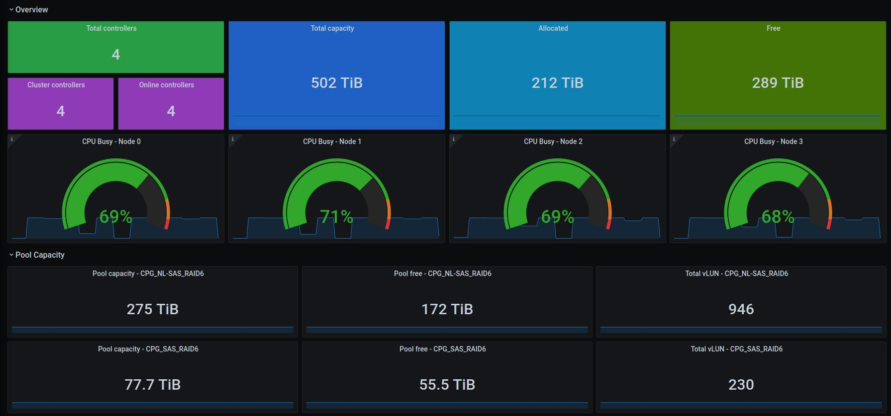

# SAN Exporter
[](LICENSE) [](https://github.com/vCloud-DFTBA/san_exporter/actions/workflows/main.yml)

Prometheus exporter for Storage Area Network (SAN).

We all know that each SAN Storage vendor has their own glossary of terms, health/performance metrics and monitoring tool.

But from operator view,
  - We normally focus on some **main metrics** which are similar on different storage platform.
  - We are **not only** monitoring SAN storage **but also** other devices and services at multi-layer (application, virtual Machine, hypervisor, operating system and physical).

That's why we build this to have an **unified monitoring/alerting solution** with Prometheus and Alermanager.

## Architecture overview


## Quick start

- Start a dummy driver with Docker
```
$ git clone git@github.com:vCloud-DFTBA/san_exporter.git
$ cd san_exporter/
$ cp examples/dummy_config.yml config.yml
# docker run --rm -p 8888:8888 -v $(pwd)/config.yml:/san-exporter/config.yml --name san-exporter daikk115/san-exporter:0.1.0
```

See the result at `http://localhost:8888/dummy_backend`

- Start a dummy driver manually

```
$ git clone git@github.com:vCloud-DFTBA/san_exporter.git
$ cd san_exporter/
$ cp examples/dummy_config.yml config.yml
$ sudo apt-get install libxml2-dev libxslt1-dev python3.7-dev
$ pip3 install -r requirements.txt
$ python3.7 manage.py
```

See the result at `http://localhost:8888/dummy_backend`

- [Start with a HPE 3PAR api simulator](docs/quickstart_with_simulator.md)

## Deployment

**Create configuration file**

```
# mkdir /root/san-exporter
# cp /path/to/san_exporter/examples/config.yml.sample /root/san-exporter/config.yml
```

Update `/root/san-exporter/config.yml` for corresponding to SAN storage

**Run new container**

```
# docker volume create san-exporter
# docker run -d -p 8888:8888 -v san-exporter:/var/log/ -v /root/san-exporter/config.yml:/san-exporter/config.yml --name san-exporter daikk115/san-exporter:latest
```

## Supported Drivers

- Matrix of driver's generic metrics

|             | **Capacity all** | **Capacity pool** | **IOPS/Throuhgput pool** | **Latency pool** | **IOPS/Throughput node** | **Latency node** | **CPU node** | **RAM node** | **IOPS/Throughput LUN** | **Latency LUN** | **IOPS/Throughput disk** | **Latency disk** | **IOPS/Throughput port** | **Latency port** | **Alert** |
| ----------- | ---------------- | ----------------- | ------------------------ | ---------------- | ------------------------ | ---------------- | ------------ | ------------ | ----------------------- | --------------- | ------------------------ | ---------------- | ------------------------ | ---------------- | --------- |
| HPMSA       | **X**            | **X**             | **X**                    | **X**            |                          | **X**            |              |              |                         |                 |                          |                  | **X**                    | **X**            | **X**     |
| DellUnity   | **X**            | **X**             |                          |                  | **X**                    |                  |              |              | **X**                   | **X**           | **X**                    | **X**            | **X**                    | **X**            | **X**     |
| HitachiG700 | **X**            | **X**             |                          |                  |                          |                  |              |              |                         |                 |                          |                  |                          |                  | **X**     |
| HPE3Par     | **X**            | **X**             | **X**                    | **X**            |                          |                  | **X**        |              |                         |                 |                          |                  |  **X**                   | **X**            | **X**     |
| NetApp      | **X**            |    **X**          |   **X**             |       **X**           |                          |                  |              |              |                         |                 | **X**                         | **X**                 |                          |                  |           |
| SC8000      |  **X**           | **X**             |                          |                  |    **X**                 | **X**            | **X**        |  **X**       |                         |                 |  **X**                   |     **X**        | **X**                    | **X**            | **X**     |
| V7k         |  **X**           | **X**             | **X**                    | **X**            |                          |                  | **X**        |              |                         |                 |                          |                  |  **X**                   |                  |           |

- Connection port requirements
  - For some SAN system, we collect metrics over SP API but some others, we collect metrics dirrectly from controller API.
  - In some special cases, we collect alerts over SSH.

| SAN System   | Service Processor | Connection Port |
|--------------|-------------------|-----------------|
| HPMSA        | NO                | 443             |
| Dell Unity   | NO                | 443             |
| Hitachi G700 | YES               | 23451           |
| IBM V7000    | NO                | #TODO           |
| IBM V5000    | NO                | #TODO           |
| HPE 3PAR     | YES               | #TODO           |
| NetApp ONTAP | NO                | 443             |
| SC8000 | NO                |        3033   |

## Metrics

All metrics are prefixed with "san_" and has at least 2 labels: `backend_name` and `san_ip`

### Info metrics:
| Metrics name     | Type  | Help                                    |
| ---------------- | ----- | --------------------------------------- |
| san_storage_info | gauge | Basic information: serial, version, ... |

### Controller metrics:
| Metrics name                    | Type  | Help                                                                                            |
| ------------------------------- | ----- | ----------------------------------------------------------------------------------------------- |
| san_totalNodes                  | gauge | Total nodes                                                                                     |
| san_masterNodes                 | gauge | Master nodes                                                                                    |
| san_onlineNodes                 | gauge | Online nodes                                                                                    |
| san_compress_support            | gauge | Compress support, 1 = Yes, 0 = No                                                               |
| san_thin_provision_support      | gauge | Thin provision support, 1 = Yes, 0 = No                                                         |
| san_system_reporter_support     | gauge | System reporter support, 1 = Yes, 0 = No                                                        |
| san_qos_support                 | gauge | QoS support, 1 = Yes, 0 = No                                                                    |
| san_totalCapacityMiB            | gauge | Total system capacity in MiB                                                                    |
| san_allocatedCapacityMiB        | gauge | Total allocated capacity in MiB                                                                 |
| san_freeCapacityMiB             | gauge | Total free capacity in MiB                                                                      |
| san_cpu_system_utilization      | gauge | The average percentage of time that the processors on nodes are busy doing system I/O tasks     |
| san_cpu_compression_utilization | gauge | The approximate percentage of time that the processor core was busy with data compression tasks |
| san_cpu_total                   | gauge | The cpus spent in each mode                                                                     |

### Pool metrics:
| Metrics name                      | Type  | Help                          |
| --------------------------------- | ----- | ----------------------------- |
| san_pool_totalLUNs                | gauge | Total LUNs (or Volumes)       |
| san_pool_total_capacity_mib       | gauge | Total capacity of pool in MiB |
| san_pool_free_capacity_mib        | gauge | Free of pool in MiB           |
| san_pool_provisioned_capacity_mib | gauge | Provisioned of pool in MiB    |
| san_pool_number_read_io           | gauge | Read I/O Rate - ops/s         |
| san_pool_number_write_io          | gauge | Write I/O Rate - ops/s        |
| san_pool_read_cache_hit           | gauge | Read Cache Hits - %           |
| san_pool_write_cache_hit          | gauge | Write Cache Hits - %          |
| san_pool_read_kb gauge            | gauge | Read Data Rate - KiB/s        |
| san_pool_write_kb                 | gauge | Write Data Rate - KiB/s       |
| san_pool_read_service_time_ms     | gauge | Read Response Time - ms/op    |
| san_pool_write_service_time_ms    | gauge | Write Response Time - ms/op   |
| san_pool_read_IOSize_kb           | gauge | Read Transfer Size - KiB/op   |
| san_pool_write_IOSize_kb          | gauge | Write Transfer Size - KiB/op  |
| san_pool_queue_length             | gauge | Queue length of pool          |

### Port metrics:
| Metrics name             | Type  | Help                              |
| ------------------------ | ----- | --------------------------------- |
| san_port_number_read_io  | gauge | Port Read I/O Rate - ops/s        |
| san_port_number_write_io | gauge | Port Write I/O Rate - ops/s       |
| san_port_write_kb        | gauge | Port Write Data Rate - KiB/s      |
| san_port_read_kb         | gauge | Port Read Data Rate - KiB/s       |
| san_port_write_IOSize_kb | gauge | Port Write Transfer Size - KiB/op |
| san_port_read_IOSize_kb  | gauge | Port Read Transfer Size - KiB/op  |
| san_port_queue_length    | gauge | Queue length of port              |

For more information about specific metrics of SANs, see [Specific SAN Metrics](docs/specific_san_metrics.md)

## Integrate with Prometheus, Alertmanager and Grafana

- [Example prometheus alert rules](examples/rules)
- [Example grafana dashboard](examples/dashboards)

**Some grafana images:**




